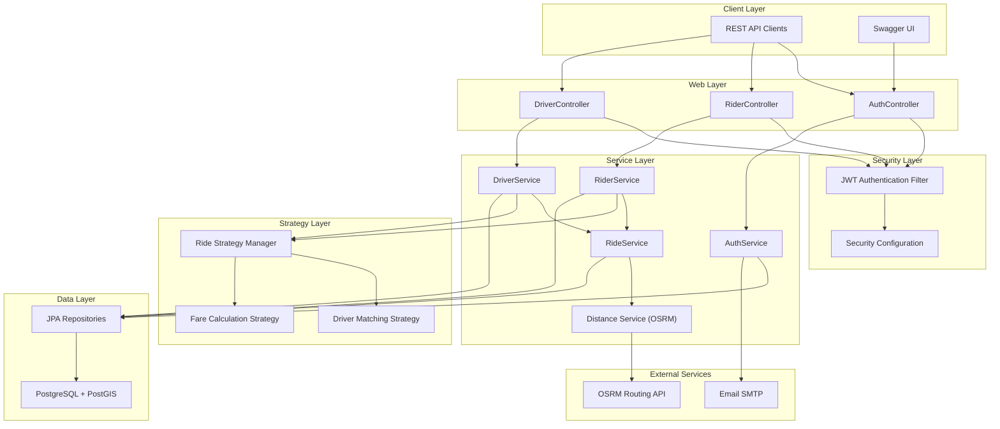
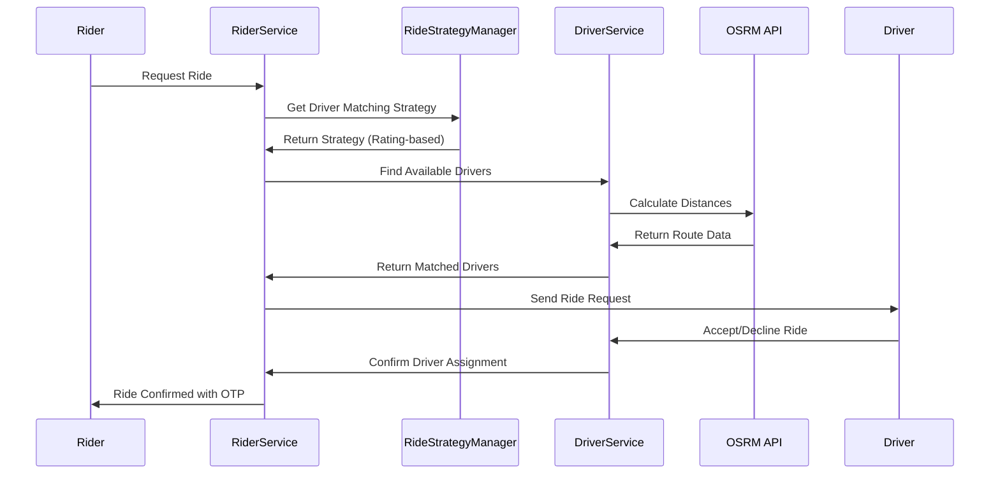
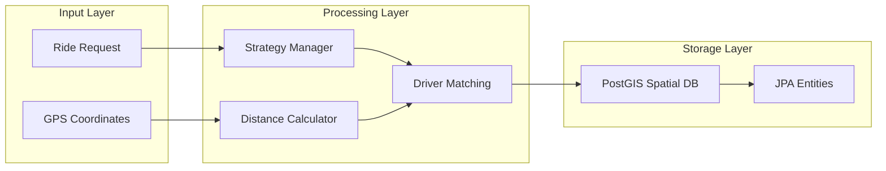

# UberApp - Spring Boot Ride-Sharing Platform

A comprehensive ride-sharing application built with Spring Boot 3.3.1, featuring real-time location tracking, JWT authentication, and spatial data processing.

## 🚀 Tech Stack

### Core Framework
- **Spring Boot 3.3.1** - Application foundation [1](#0-0) 
- **Java 17** - Programming language [2](#0-1) 
- **Maven 3.8.5** - Build automation and dependency management

### Database & Spatial Processing
- **PostgreSQL** - Primary database [3](#0-2) 
- **Hibernate Spatial 6.5.2** - Geographic data handling [4](#0-3) 
- **Spring Data JPA** - Data access layer [5](#0-4) 

### Security & Authentication
- **Spring Security** - Authentication framework [6](#0-5) 
- **JWT (JJWT 0.12.6)** - Token-based authentication [7](#0-6) 

### API & Documentation
- **Spring Web** - REST API framework [8](#0-7) 
- **SpringDoc OpenAPI 3** - API documentation [9](#0-8) 
- **Spring Boot Actuator** - Monitoring and health checks [10](#0-9) 

### Additional Libraries
- **ModelMapper 3.2.0** - Object mapping [11](#0-10) 
- **Spring Boot Mail** - Email notifications [12](#0-11) 
- **Lombok** - Code generation [13](#0-12) 

## 🏗️ System Architecture



## 🎯 Core Features

### User Management
- **Multi-role system**: RIDER, DRIVER, ADMIN roles
- **JWT-based authentication** with secure token management
- **Email verification** and notifications

### Ride Management
- **Real-time ride requests** with status tracking [14](#0-13) 
- **Dynamic driver matching** based on proximity and ratings [15](#0-14) 
- **OTP-based ride verification** [16](#0-15) 

### Intelligent Pricing & Matching
- **Surge pricing** during peak hours (6PM-9PM) [17](#0-16) 
- **Rating-based driver matching** for premium riders [18](#0-17) 

### Location Services
- **OSRM integration** for accurate distance calculation [19](#0-18) 
- **PostGIS spatial queries** for geographic operations

## 🔄 Ride Flow Diagram



## 📊 Data Flow Architecture



## 🚀 Getting Started

### Prerequisites
- Java 17+
- Maven 3.8.5+
- PostgreSQL with PostGIS extension
- Docker (optional)

### Installation

1. **Clone the repository**
```bash
git clone https://github.com/im-vishesh15th/uber-spring-boot.git
cd uber-spring-boot
```

2. **Configure database**
```properties
spring.datasource.url=jdbc:postgresql://localhost:5432/uberdb
spring.datasource.username=your_username
spring.datasource.password=your_password
```

3. **Build and run**
```bash
mvn clean install
mvn spring-boot:run
```

4. **Access API documentation**
    - Swagger UI: `http://localhost:8080/swagger-ui/index.html`
    - Health Check: `http://localhost:8080/actuator/health`

## 📁 Project Structure

```
src/main/java/com/codingshuttle/project/uber/uberApp/
├── controllers/          # REST API endpoints
├── services/            # Business logic layer
├── strategies/          # Strategy pattern implementations
├── entities/           # JPA entities
├── repositories/       # Data access layer
├── dto/               # Data transfer objects
└── config/            # Configuration classes
```

## 🔧 Configuration

The application uses Spring Boot's auto-configuration with custom beans for:
- **ModelMapper** for object mapping
- **Security configuration** for JWT authentication
- **CORS configuration** for cross-origin requests

